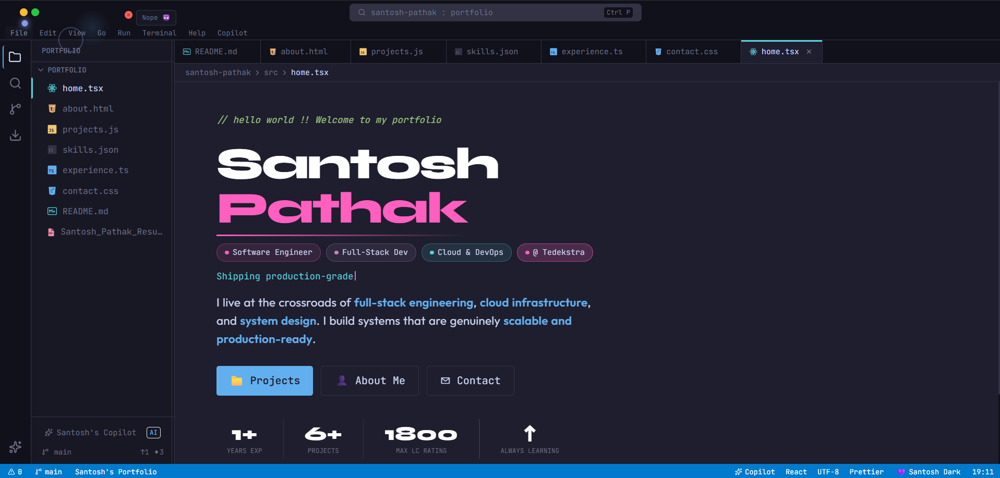

# Santosh Pathak — Portfolio



VS Code-themed single-page portfolio styled as a "Santosh Dark" editor window.

## Tech Stack

- **Next.js 14** (App Router)
- **React 18** + **TypeScript**
- **Tailwind CSS** (custom VS Code theme tokens)
- **lucide-react** for icons
- **JetBrains Mono** + **Inter** via `next/font/google`

## Features

- Full VS Code chrome: browser bar, title bar, sidebar with file icons, tab bar, breadcrumbs, status bar
- Working `Ctrl/Cmd+P` command palette with keyboard navigation
- Copilot AI side panel with suggestion chips and mock chat
- 7 portfolio sections styled as open files: `home.tsx`, `about.html`, `projects.js`, `skills.json`, `experience.ts`, `contact.css`, `README.md`
- Animated skill progress bars, project cards, vertical experience timeline
- Scroll spy keeps active file/tab in sync
- Responsive: mobile sidebar drawer, simplified status bar, copilot fullscreen overlay

## Getting Started

```bash
npm install
npm run dev
```

Open [http://localhost:3000](http://localhost:3000).

## Customizing Content

All editable content lives in [`data/portfolio.ts`](data/portfolio.ts). Update `projects[]`, `experience[]`, `skillCategories[]`, `contactLinks[]` etc. without touching any component.
##
Made with ♥️ by Santosh Pathak
